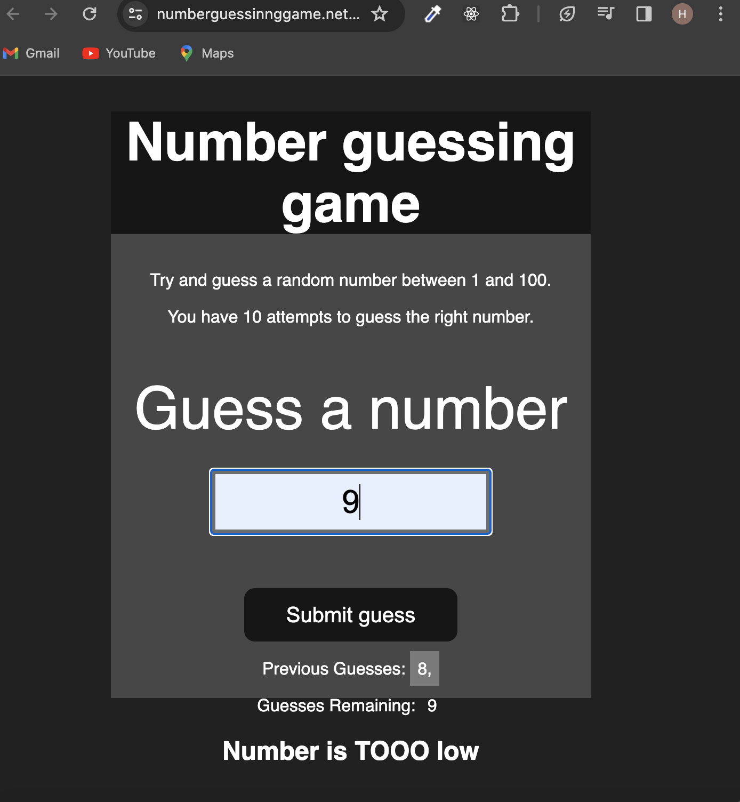

### Number Guessing Game -Project Documentation

### Introduction
The Number Guessing Game is a web application designed to provide users with an interactive and entertaining experience by challenging them to guess a randomly generated number within a specified range. This project aims to offer a simple yet engaging game for users of all ages.


### Demo :



### You can Check it Live on Below Link :

[Live Link !](https://numberguessinnggame.netlify.app/)


### Features

- Random Number Generation: The game generates a random number within a user-defined range.

- User Input: Players can input their guessed numbers within the specified range.

- Feedback: The game provides feedback on whether the guessed number is too high, too low, or correct.

- Winning Celebration: A celebratory message is displayed when the player correctly guesses the number.

### Technologies Used
1. Frontend: HTML, CSS, JavaScript
2. Deployment: Netlify


Installation

1. Clone the repository:
```
git clone https://github.com/your-username/number-guessing-game.git


```

2. Navigate to the project directory:

```
cd number-guessing-game


```

3. Open the index.html file in a web browser.


### How to Play
- Open the Number Guessing Game in a web browser.
- Enter your preferred range for the random number.
- Guess a number within the specified range.
- Receive feedback on whether your guess is too high, too low, or      correct.
- Continue guessing until you correctly identify the random number.


### Customization

Users can customize the game by modifying the JavaScript code to adjust the range of random numbers or add additional features.


### Contributing

If you would like to contribute to the project, follow these steps:

- Fork the repository.
- Create a new branch for your feature or bug fix.
- Make changes and submit a pull request.